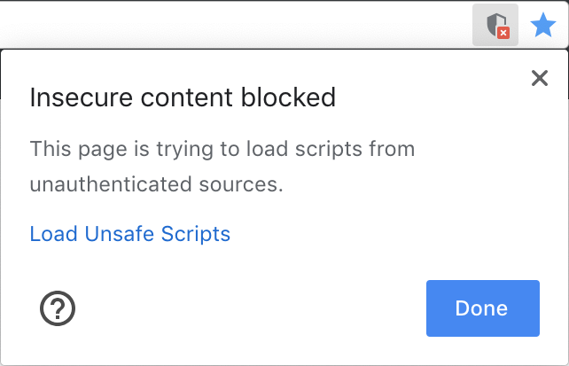

# Pystation-Stream 
Stream site built for [Pystation](https://github.com/FriendlyAI/Pystation)

## Important Security Information
In order for the `now playing` header to load, you must disable blocking of "unsafe sources" on your browser. Don't 
worry, the "unsafe source" is just a JSON file. I'm sorry, but I'm not buying an SSL certificate. 
 
### Chrome
Click `Load Unsafe Scripts` on the right edge of the address bar.

### Firefox
Press the green padlock on the left edge of the address bar and expand the connection options.

Then click `Disable protection for now`.

